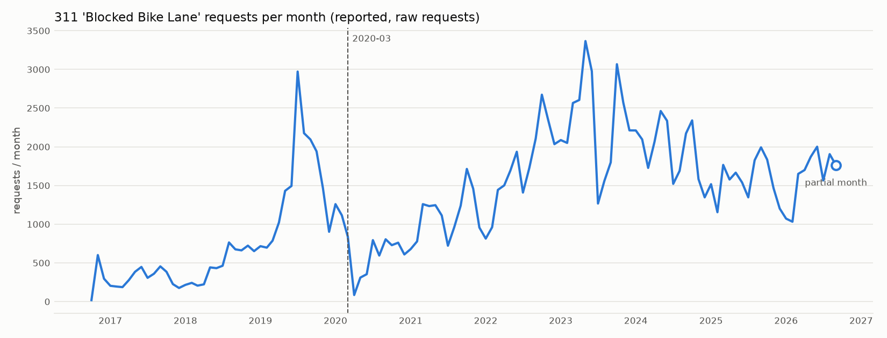

# M1 data audit

_Generated by `python -m clearlane.audit.m1_audit` from cached Socrata responses. Do not hand-edit._

All counts are **reported** obstruction (311 service requests), not observed obstruction.

## 1. Run metadata

- Generated: 2026-10-01T02:50:17-04:00
- As-of date (defines 'current year' / 'last full years'): 2026-09-30
- Git commit: b1ae845072e955961289d3bfc343af1c57171dce (working tree dirty)
- Data source: cache — cache hits=624, misses=0
- Cache dir: `data/raw/m1`
- 311 datasets queried: `76ig-c548` (311 Service Requests from 2010 to 2019); `erm2-nwe9` (311 Service Requests from 2020 to Present)

## 2. 311 taxonomy

Grouped `(complaint_type, descriptor)` counts, all dates, across both 311 datasets. Counts come from an unfiltered server-side group-by of every pair (one query per month), matched client-side with the equivalent of `upper(field) like '%PATTERN%'` on either field.

### Pairs matching `%BIKE%`

| complaint_type | descriptor | 76ig-c548 | erm2-nwe9 | total | first_seen | last_seen |
|---|---|---|---|---|---|---|
| Illegal Parking | Blocked Bike Lane | 27,920 | 127,434 | 155,354 | 2016-10-19 | 2026-09-29 |
| Bike/Roller/Skate Chronic | N/A | 4,519 | 15,651 | 20,170 | 2010-01-02 | 2025-11-12 |
| Abandoned Bike | Chained to Public Property | 0 | 10,491 | 10,491 | 2021-09-21 | 2026-09-29 |
| Bike Rack Condition | Bike Rack Repair | 941 | 993 | 1,934 | 2011-06-24 | 2024-07-25 |
| Bike/Roller/Skate | N/A | 0 | 1,789 | 1,789 | 2025-11-13 | 2026-09-29 |
| Traffic Signal Condition | Bike Signal | 0 | 1,174 | 1,174 | 2020-07-09 | 2026-09-24 |
| Bike Rack | Abandoned Bike | 0 | 738 | 738 | 2024-11-27 | 2026-09-28 |
| Bike Rack | Damaged/Bent/Loose/Leaning | 0 | 508 | 508 | 2024-07-25 | 2026-09-29 |
| Bike Rack Condition | Chained Bike | 225 | 6 | 231 | 2010-11-09 | 2022-08-14 |
| Snow or Ice | Bike Lane | 0 | 184 | 184 | 2022-01-10 | 2026-02-16 |
| Bike Rack | Missing | 0 | 112 | 112 | 2024-07-31 | 2026-09-15 |
| Building Condition | Bikes in Buildings | 26 | 44 | 70 | 2011-07-13 | 2026-08-13 |
| Bike Rack | Graffiti | 0 | 10 | 10 | 2024-07-31 | 2026-08-11 |

**Target pair used in the rest of this report:** `complaint_type = 'Illegal Parking'`, `descriptor = 'Blocked Bike Lane'` (155,354 rows).

Other pairs mentioning 'bike lane' (not treated as target): `Snow or Ice / Bike Lane` (184)

### Pairs matching `%DOUBLE PARK%`

| complaint_type | descriptor | 76ig-c548 | erm2-nwe9 | total | first_seen | last_seen |
|---|---|---|---|---|---|---|
| Illegal Parking | Double Parked Blocking Traffic | 64,574 | 168,649 | 233,223 | 2010-06-03 | 2026-09-30 |
| Illegal Parking | Double Parked Blocking Vehicle | 47,797 | 90,659 | 138,456 | 2010-06-04 | 2026-09-30 |
| Traffic/Illegal Parking | Double Parked Blocking Vehicle | 1,338 | 0 | 1,338 | 2010-01-01 | 2010-06-03 |
| Traffic/Illegal Parking | Double Parked Blocking Traffic | 1,124 | 0 | 1,124 | 2010-01-01 | 2010-06-03 |
| Noise - Street/Sidewalk | Double Parked Blocking Vehicle | 0 | 1 | 1 | 2024-09-25 | 2024-09-25 |

Double-parking descriptors found: `Illegal Parking / Double Parked Blocking Traffic`, `Illegal Parking / Double Parked Blocking Vehicle`, `Traffic/Illegal Parking / Double Parked Blocking Vehicle`, `Traffic/Illegal Parking / Double Parked Blocking Traffic`, `Noise - Street/Sidewalk / Double Parked Blocking Vehicle`

## 3. Volume by year

Target pair, by `date_extract_y(created_date)`, combined across 311 datasets.

| year | n | note |
|---|---|---|
| 2016 | 916 | category starts mid-year |
| 2017 | 3,605 |  |
| 2018 | 5,700 |  |
| 2019 | 17,699 |  |
| 2020 | 8,255 |  |
| 2021 | 13,362 |  |
| 2022 | 20,642 |  |
| 2023 | 28,127 |  |
| 2024 | 23,548 |  |
| 2025 | 18,887 |  |
| 2026 | 14,613 | partial (to as-of date) |

Per-dataset coverage for the target pair (from the section 2 taxonomy query):

| dataset | rows (all dates) | first | last |
|---|---|---|---|
| 76ig-c548 | 27,920 | 2016-10-19T08:01:31 | 2019-12-31T18:29:26 |
| erm2-nwe9 | 127,434 | 2020-01-01T09:45:50 | 2026-09-29T22:53:00 |

## 4. Volume by month

Months covered: 2016-10 → 2026-09. Month-over-month changes below exclude the current month (2026-09, partial).

**Five largest month-over-month drops**

| month | prev | value | change | pct |
|---|---|---|---|---|
| 2023-07 | 2,977 | 1,267 | -1,710 | -57% |
| 2024-07 | 2,336 | 1,521 | -815 | -35% |
| 2019-08 | 2,972 | 2,176 | -796 | -27% |
| 2024-11 | 2,341 | 1,582 | -759 | -32% |
| 2020-04 | 839 | 85 | -754 | -90% |

**Five largest month-over-month rises**

| month | prev | value | change | pct |
|---|---|---|---|---|
| 2019-07 | 1,494 | 2,972 | 1,478 | +99% |
| 2023-10 | 1,799 | 3,067 | 1,268 | +70% |
| 2023-05 | 2,605 | 3,366 | 761 | +29% |
| 2026-03 | 1,032 | 1,650 | 618 | +60% |
| 2025-03 | 1,155 | 1,766 | 611 | +53% |

Full monthly series

| month | n |
|---|---|
| 2016-10 | 19 |
| 2016-11 | 601 |
| 2016-12 | 296 |
| 2017-01 | 204 |
| 2017-02 | 194 |
| 2017-03 | 187 |
| 2017-04 | 278 |
| 2017-05 | 385 |
| 2017-06 | 448 |
| 2017-07 | 307 |
| 2017-08 | 360 |
| 2017-09 | 455 |
| 2017-10 | 385 |
| 2017-11 | 226 |
| 2017-12 | 176 |
| 2018-01 | 216 |
| 2018-02 | 242 |
| 2018-03 | 206 |
| 2018-04 | 223 |
| 2018-05 | 442 |
| 2018-06 | 432 |
| 2018-07 | 463 |
| 2018-08 | 764 |
| 2018-09 | 675 |
| 2018-10 | 662 |
| 2018-11 | 723 |
| 2018-12 | 652 |
| 2019-01 | 716 |
| 2019-02 | 697 |
| 2019-03 | 787 |
| 2019-04 | 1,022 |
| 2019-05 | 1,431 |
| 2019-06 | 1,494 |
| 2019-07 | 2,972 |
| 2019-08 | 2,176 |
| 2019-09 | 2,095 |
| 2019-10 | 1,941 |
| 2019-11 | 1,466 |
| 2019-12 | 902 |
| 2020-01 | 1,259 |
| 2020-02 | 1,115 |
| 2020-03 | 839 |
| 2020-04 | 85 |
| 2020-05 | 310 |
| 2020-06 | 354 |
| 2020-07 | 794 |
| 2020-08 | 595 |
| 2020-09 | 805 |
| 2020-10 | 729 |
| 2020-11 | 761 |
| 2020-12 | 609 |
| 2021-01 | 679 |
| 2021-02 | 778 |
| 2021-03 | 1,259 |
| 2021-04 | 1,234 |
| 2021-05 | 1,246 |
| 2021-06 | 1,113 |
| 2021-07 | 722 |
| 2021-08 | 963 |
| 2021-09 | 1,239 |
| 2021-10 | 1,714 |
| 2021-11 | 1,458 |
| 2021-12 | 957 |
| 2022-01 | 814 |
| 2022-02 | 961 |
| 2022-03 | 1,443 |
| 2022-04 | 1,502 |
| 2022-05 | 1,694 |
| 2022-06 | 1,936 |
| 2022-07 | 1,409 |
| 2022-08 | 1,727 |
| 2022-09 | 2,106 |
| 2022-10 | 2,673 |
| 2022-11 | 2,343 |
| 2022-12 | 2,034 |
| 2023-01 | 2,087 |
| 2023-02 | 2,050 |
| 2023-03 | 2,566 |
| 2023-04 | 2,605 |
| 2023-05 | 3,366 |
| 2023-06 | 2,977 |
| 2023-07 | 1,267 |
| 2023-08 | 1,559 |
| 2023-09 | 1,799 |
| 2023-10 | 3,067 |
| 2023-11 | 2,572 |
| 2023-12 | 2,212 |
| 2024-01 | 2,211 |
| 2024-02 | 2,095 |
| 2024-03 | 1,727 |
| 2024-04 | 2,065 |
| 2024-05 | 2,462 |
| 2024-06 | 2,336 |
| 2024-07 | 1,521 |
| 2024-08 | 1,689 |
| 2024-09 | 2,172 |
| 2024-10 | 2,341 |
| 2024-11 | 1,582 |
| 2024-12 | 1,347 |
| 2025-01 | 1,517 |
| 2025-02 | 1,155 |
| 2025-03 | 1,766 |
| 2025-04 | 1,577 |
| 2025-05 | 1,666 |
| 2025-06 | 1,539 |
| 2025-07 | 1,347 |
| 2025-08 | 1,826 |
| 2025-09 | 1,993 |
| 2025-10 | 1,834 |
| 2025-11 | 1,465 |
| 2025-12 | 1,202 |
| 2026-01 | 1,072 |
| 2026-02 | 1,032 |
| 2026-03 | 1,650 |
| 2026-04 | 1,700 |
| 2026-05 | 1,871 |
| 2026-06 | 2,001 |
| 2026-07 | 1,565 |
| 2026-08 | 1,905 |
| 2026-09 | 1,760 |

## 5. Coordinate quality

Target pair, last 3 full years (2023–2025). Bbox check is server-side: lat 40.47–40.93, lon -74.27 to -73.68; 'outside' counts rows with non-null coordinates outside that box.

| year | rows | null_latlon | outside_bbox | null_share | outside_share |
|---|---|---|---|---|---|
| 2023 | 28,127 | 37 | 0 | 0.13% | 0.00% |
| 2024 | 23,548 | 20 | 0 | 0.08% | 0.00% |
| 2025 | 18,887 | 30 | 0 | 0.16% | 0.00% |
| all | 70,562 | 87 | 0 | 0.12% | 0.00% |

## 6. Day-of-week convention check

Query: `date_extract_dow(created_date)` grouped, for created_date on 2025-06-02 (a Monday). Scope: target pair.

| dow | n |
|---|---|
| 1 | 73 |

**Verified convention:** Monday returned dow=1, so Socrata `date_extract_dow` uses 0 = Sunday … 6 = Saturday. Section 7 uses `sunday_is_zero=True`.

## 7. Hour-of-week distribution

Target pair, 2024–2025, 168 bins (0 = Mon 00:00), raw requests.

- min per bin: 1 (Mon 03:00)
- median per bin: 240.0
- max per bin: 751 (Fri 17:00)
- total: 42,435

**Top 10 bins**

| hour_of_week | slot | events |
|---|---|---|
| 113 | Fri 17:00 | 751 |
| 41 | Tue 17:00 | 746 |
| 65 | Wed 17:00 | 737 |
| 114 | Fri 18:00 | 730 |
| 66 | Wed 18:00 | 702 |
| 89 | Thu 17:00 | 702 |
| 18 | Mon 18:00 | 679 |
| 33 | Tue 09:00 | 666 |
| 9 | Mon 09:00 | 644 |
| 57 | Wed 09:00 | 636 |

**Bottom 10 bins**

| hour_of_week | slot | events |
|---|---|---|
| 3 | Mon 03:00 | 1 |
| 4 | Mon 04:00 | 2 |
| 2 | Mon 02:00 | 4 |
| 27 | Tue 03:00 | 5 |
| 52 | Wed 04:00 | 6 |
| 74 | Thu 02:00 | 9 |
| 124 | Sat 04:00 | 9 |
| 149 | Sun 05:00 | 9 |
| 28 | Tue 04:00 | 10 |
| 123 | Sat 03:00 | 10 |

Full 7×24 grid

| day | 00 | 01 | 02 | 03 | 04 | 05 | 06 | 07 | 08 | 09 | 10 | 11 | 12 | 13 | 14 | 15 | 16 | 17 | 18 | 19 | 20 | 21 | 22 | 23 |
|---|---|---|---|---|---|---|---|---|---|---|---|---|---|---|---|---|---|---|---|---|---|---|---|---|
| Mon | 32 | 33 | 4 | 1 | 2 | 13 | 47 | 156 | 388 | 644 | 445 | 291 | 357 | 360 | 343 | 420 | 374 | 487 | 679 | 315 | 271 | 127 | 121 | 64 |
| Tue | 35 | 20 | 13 | 5 | 10 | 20 | 68 | 183 | 487 | 666 | 415 | 356 | 338 | 420 | 466 | 331 | 383 | 746 | 628 | 309 | 300 | 199 | 188 | 57 |
| Wed | 30 | 23 | 15 | 19 | 6 | 15 | 63 | 219 | 493 | 636 | 417 | 370 | 428 | 454 | 412 | 497 | 416 | 737 | 702 | 405 | 247 | 276 | 168 | 90 |
| Thu | 91 | 44 | 9 | 14 | 28 | 15 | 60 | 152 | 445 | 617 | 324 | 368 | 379 | 333 | 410 | 549 | 458 | 702 | 629 | 349 | 233 | 216 | 161 | 84 |
| Fri | 73 | 26 | 73 | 25 | 18 | 16 | 37 | 165 | 385 | 585 | 457 | 426 | 408 | 471 | 520 | 410 | 576 | 751 | 730 | 391 | 318 | 205 | 146 | 123 |
| Sat | 82 | 30 | 13 | 10 | 9 | 12 | 17 | 57 | 101 | 157 | 313 | 322 | 403 | 371 | 362 | 445 | 313 | 319 | 273 | 189 | 187 | 156 | 150 | 70 |
| Sun | 45 | 35 | 21 | 14 | 14 | 9 | 25 | 30 | 68 | 158 | 302 | 441 | 344 | 316 | 321 | 413 | 361 | 400 | 271 | 251 | 158 | 164 | 90 | 63 |

## 8. Sparsity estimate

Annual target count = mean of 2024 (23,548) and 2025 (18,887) = 21,218 raw requests (before dedup to incidents and before snapping).
Expected events per cell-slot-month = annual ÷ (slots × 12) ÷ N, assuming events spread evenly.

| N cells | per cell-slot-month (168 hourly slots) | per cell-slot-month (56 three-hour slots) |
|---|---|---|
| 2,000 | 0.005262 | 0.01579 |
| 4,000 | 0.002631 | 0.007893 |
| 6,000 | 0.001754 | 0.005262 |

## 9. Resolution descriptions

Target pair, 2024–2025. 19 distinct values; total 42,435. Context only.

| resolution_description | n | share |
|---|---|---|
| The Police Department responded and upon arrival those responsible for the condition were gone. | 14,437 | 34.0% |
| The Police Department responded to the complaint and took action to fix the condition. | 10,269 | 24.2% |
| The Police Department responded to the complaint and with the information available observed no evidence of the violation at that time. | 8,828 | 20.8% |
| The Police Department responded to the complaint and determined that police action was not necessary. | 4,087 | 9.6% |
| The Police Department issued a summons in response to the complaint. | 1,954 | 4.6% |
| The New York City Police Department responded to the complaint and observed no criminal violation upon their arrival. If the problem persists, please contact 311 to create another complaint. If possible, provide contact information so responding officers may reach out to you for more details. We count on New Yorkers like yourself to maintain a safe City, so please let us know if you see other conditions that require our attention. | 957 | 2.3% |
| The Police Department reviewed your complaint and provided additional information below. | 500 | 1.2% |
| The New York City Police Department responded to the complaint and with the information available observed no evidence of a criminal violation at that time. If the problem persists, please contact 311 to create another complaint. If possible, provide contact information so responding officers may reach out to you for more details. If necessary, your complaint may be referred to your local precinct's special operations units (Quality of Life, etc.). We count on New Yorkers like yourself to maintain a safe City, so please let us know if you see other conditions that require our attention. | 378 | 0.9% |
| The New York City Police Department responded to the complaint and their investigation determined that no criminal violation existed. The condition was corrected without the need to issue a summons or effect an arrest. If the problem persists, please contact 311 to create another complaint. If possible, provide contact information so responding officers may reach out to you for more details. If necessary, your complaint may be referred to your local precinct's special operations units (Quality of Life, etc.). Thank you for your attention to this matter. We count on New Yorkers like yourself to maintain a safe City, so please let us know if you see other conditions that require our attention. | 362 | 0.9% |
| The New York City Police Department responded to the complaint and their investigation determined that police action was not necessary. If the problem persists, please contact 311 to create another complaint. If possible, provide contact information so responding officers may reach out to you for more details. We count on New Yorkers like yourself to maintain a safe City, so please let us know if you see other conditions that require our attention. | 252 | 0.6% |
| This complaint does not fall under the Police Department's jurisdiction. | 172 | 0.4% |
| The New York City Police Department responded to the complaint and their investigation determined that a violation of law occurred. Police issued a summons in response to the complaint. Thank you for attention to this matter. We count on New Yorkers like yourself to maintain a safe City, so please let us know if you see other conditions that require our attention. | 121 | 0.3% |
| Your request can not be processed at this time because of insufficient contact information. Please create a new Service Request on NYC.gov and provide more detailed contact information. | 77 | 0.2% |
| The Police Department responded to the complaint and a report was prepared. | 16 | 0.0% |
| The Police Department responded to the complaint but officers were unable to gain entry into the premises. | 14 | 0.0% |

## 10. DOT bike-route dataset

Discovery query: `q=bicycle routes` on data.cityofnewyork.us.

| id | name | type | updated |
|---|---|---|---|
| 9e2b-mctv | New York City Bike Routes	 (Map) | map | 2026-07-24 |
| mzxg-pwib | New York City Bike Routes | dataset | 2026-07-24 |
| xiyt-f6tz | NYCDCP Manhattan Bike Count Locations | map | 2016-09-12 |
| 3we2-bw9s | NYCDCP_Manhattan_Bike_Counts | dataset | 2016-09-12 |
| qfs9-xn8t | NYCDCP Manhattan Bike Counts - On Street Weekday | dataset | 2016-09-12 |
| mfmf-gtvc | NYCDCP Manhattan Bike Counts - Off Street | dataset | 2016-09-12 |
| 79sh-heg3 | VZV Street Improvement Projects (SIPs) Intersections | map | 2026-09-01 |
| wqhs-q6wd | VZV Street Improvement Projects (SIPs) Corridor | map | 2026-09-01 |
| shr7-eqdc | VZV Street Improvement Projects (SIP) Intersections | dataset | 2026-09-01 |
| if4c-w48d | VZV Street Improvement Projects (SIP) Corridor | dataset | 2026-09-01 |
| fg5j-q5nk | Internet Master Plan: Adoption and Infrastructure Data by Neighborhood | dataset | 2021-03-12 |

**Picked:** `mzxg-pwib` — New York City Bike Routes.

> The New York City Department of Transportation (NYC DOT) builds and manages bicycle facilities across the five boroughs, alongside other City agencies, New York State, and external partners. This dataset contain records of the current and historic network of designated bicycle routes and facilities, including bicycle facility type and relevant street information represented as line segments. Additional information about NYC DOT's commitment to safe all-ages and abilities bicycling, along with data about the growth of bicycling in NYC and PDF maps of the current network can be found at: https://www.nyc.gov/html/dot/html/bicyclists/bicyclists.shtml

Columns from a `$limit=5` sample (17): `allclasses`, `bikedir`, `bikeid`, `boro`, `facilitycl`, `fromstreet`, `ft_facilit`, `instdate`, `lanecount`, `onoffst`, `prevbikeid`, `segmentid`, `status`, `street`, `tf_facilit`, `the_geom`, `tostreet`

Columns from catalog schema (25): `allclasses` (Text), `facilitycl` (Text), `ft_facilit` (Text), `tostreet` (Text), `bikeid` (Number), `spur` (Text), `tf_facilit` (Text), `prevbikeid` (Text), `instdate` (Calendar date), `street` (Text), `fromstreet` (Text), `status` (Text), `boro` (Number), `segmentid` (Text), `ret_date` (Calendar date), `gwsystem` (Text), `onoffst` (Text), `bikedir` (Text), `ft2facilit` (Text), `lanecount` (Number), `gwyjuris` (Text), `tf2facilit` (Text), `gwsys2` (Text), `grnwy` (Text), `the_geom` (MultiLine)

In the schema but absent from the 5-row sample (Socrata omits nulls): `ft2facilit`, `grnwy`, `gwsys2`, `gwsystem`, `gwyjuris`, `ret_date`, `spur`, `tf2facilit`

**Column identification:**

- facility type: `allclasses`, `facilitycl`, `ft2facilit`, `ft_facilit`, `tf2facilit`, `tf_facilit`
- install date: `instdate`
- retire date: `ret_date`
- status: `status`

**Rows by status:**

| status | n | n_with_ret_date | min_instdate | max_instdate |
|---|---|---|---|---|
| Current | 24,461 | 0 | 1894-06-15 | 2026-06-15 |
| Retired | 5,234 | 5,217 | 1900-01-01 | 2024-12-31 |

## 11. DOF Parking Violations

Discovery query: `q=Parking Violations Issued` on data.cityofnewyork.us.

| id | name | type | updated |
|---|---|---|---|
| pvqr-7yc4 | Parking Violations Issued - Fiscal Year 2027 | dataset | 2026-09-17 |
| kiv2-tbus | Parking Violations Issued - Fiscal Year 2016 | dataset | 2026-01-15 |
| 2bnn-yakx | Parking Violations Issued - Fiscal Year 2017 | dataset | 2026-01-15 |
| faiq-9dfq | Parking Violations Issued - Fiscal Year 2019 | dataset | 2026-01-15 |
| 7mxj-7a6y | Parking Violations Issued - Fiscal Year 2022 | dataset | 2026-01-15 |
| jt7v-77mi | Parking Violations Issued - Fiscal Year 2014 | dataset | 2026-01-15 |
| a5td-mswe | Parking Violations Issued - Fiscal Year 2018 | dataset | 2026-01-15 |
| p7t3-5i9s | Parking Violations Issued - Fiscal Year 2020 | dataset | 2026-01-15 |
| 869v-vr48 | Parking Violations Issued - Fiscal Year 2023 | dataset | 2026-01-15 |
| c284-tqph | Parking Violations Issued - Fiscal Year 2015 | dataset | 2026-01-15 |
| kvfd-bves | Parking Violations Issued - Fiscal Year 2021 | dataset | 2026-01-15 |
| m5vz-tzqv | Parking Violations Issued - Fiscal Year 2025 | dataset | 2026-03-12 |
| 8zf9-spf8 | Parking Violations Issued - Fiscal Year 2024 | dataset | 2026-03-12 |
| 9mwx-gamw | Parking Violations Issued - Fiscal Year 2026 | dataset | 2026-08-18 |
| nc67-uf89 | Open Parking and Camera Violations | dataset | 2026-09-30 |
| i4p3-pe6a | Open Parking and Camera Violations | story | 2023-08-29 |
| jz4z-kudi | OATH Hearings Division Case Status | dataset | 2026-10-01 |
| y3hw-z6bm | OATH Trials Division Case Status | dataset | 2026-09-05 |

**Picked (most recent fiscal year):** `pvqr-7yc4` — Parking Violations Issued - Fiscal Year 2027.

Columns from catalog schema (44): `law_section` (Number), `unregistered_vehicle` (Text), `fiscal_year` (Number), `issuer_squad` (Text), `date_first_observed` (Number), `violation_location` (Text), `street_code2` (Number), `time_first_observed` (Text), `registration_state` (Text), `vehicle_year` (Number), `summons_number` (Number), `double_parking_violation` (Text), `days_parking_in_effect` (Text), `violation_description` (Text), `meter_number` (Text), `violation_county` (Text), `from_hours_in_effect` (Text), `vehicle_body_type` (Text), `to_hours_in_effect` (Text), `hydrant_violation` (Text), `violation_precinct` (Number), `violation_time` (Text), `street_code3` (Number), `vehicle_expiration_date` (Text), `violation_in_front_of_or_opposite` (Text), `street_code1` (Number), `plate_id` (Text), `vehicle_color` (Text), `sub_division` (Text), `house_number` (Text), `issuer_command` (Text), `issue_date` (Calendar date), `street_name` (Text), `violation_code` (Number), `no_standing_or_stopping_violation` (Text), `feet_from_curb` (Number), `vehicle_make` (Text), `issuer_code` (Number), `issuing_agency` (Text), `intersecting_street` (Text), `violation_legal_code` (Text), `plate_type` (Text), `violation_post_code` (Text), `issuer_precinct` (Number)

Columns seen in a `$limit=5` sample (37): `date_first_observed`, `days_parking_in_effect`, `feet_from_curb`, `fiscal_year`, `from_hours_in_effect`, `house_number`, `issue_date`, `issuer_code`, `issuer_command`, `issuer_precinct`, `issuer_squad`, `issuing_agency`, `law_section`, `meter_number`, `plate_id`, `plate_type`, `registration_state`, `street_code1`, `street_code2`, `street_code3`, `street_name`, `sub_division`, `summons_number`, `time_first_observed`, `to_hours_in_effect`, `unregistered_vehicle`, `vehicle_body_type`, `vehicle_color`, `vehicle_expiration_date`, `vehicle_make`, `vehicle_year`, `violation_code`, `violation_county`, `violation_in_front_of_or_opposite`, `violation_location`, `violation_precinct`, `violation_time`

**No latitude/longitude or point/location column exists.** Location fields are address- or code-based (e.g. house number, street name, street codes, precinct).

## 12. Open questions

- The 311 data now lives in two datasets: `erm2-nwe9` covers 2020 onward only, and 2010–2019 is in `76ig-c548`. CLAUDE.md lists only `erm2-nwe9`. This audit queries both and combines them.
- The earliest target row is 2016-10-19, before the Nov 2016 start date in CLAUDE.md.
- The bike-route dataset has several facility-type columns: `allclasses`, `facilitycl`, `ft2facilit`, `ft_facilit`, `tf2facilit`, `tf_facilit`. Which one (or which combination) defines lane type is not settled by this audit.
- 17 of 5,234 'Retired' bike-route rows have no `ret_date`.
- The earliest bike-route `instdate` values are 1894-06-15, 1900-01-01. These may be placeholder dates; this audit does not count how many rows carry them.
